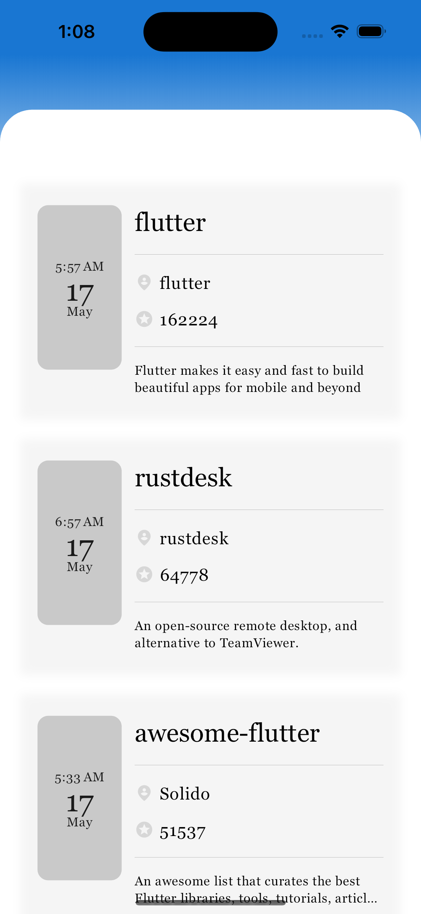
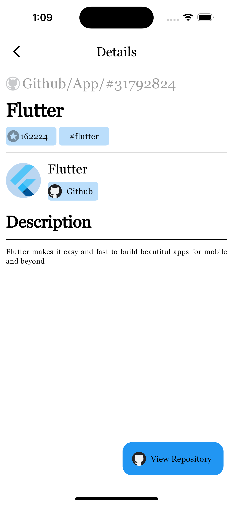

# bs_flutter_task_Muktadir

Flutter Task.

## Getting Started

1. The project has been implemented in clean architecture.
2. There are three layers(data,domain,presentation) to write the code separately.
3. Data layer contains - DataSources, Models and Repositories
4. Domain layer is the midman of data and presentation layer which contains business logics and should be independent from other layers. It contains - Entities, Repositories and UseCases
5. Presentation layer contains - Controllers, Views, Widgets, Bindings 
6. I have used Getx for Dependency Management, Route Management and State Management
8. For storing data locally i have used Sqlite database and get storage for small data
9. I have strictly followed SOLID PRINCIPLES in this project

## Screenshots

